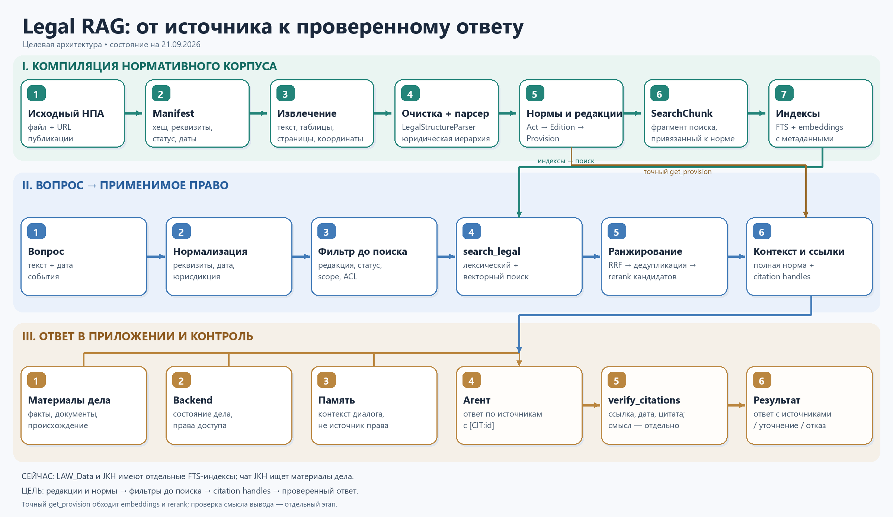
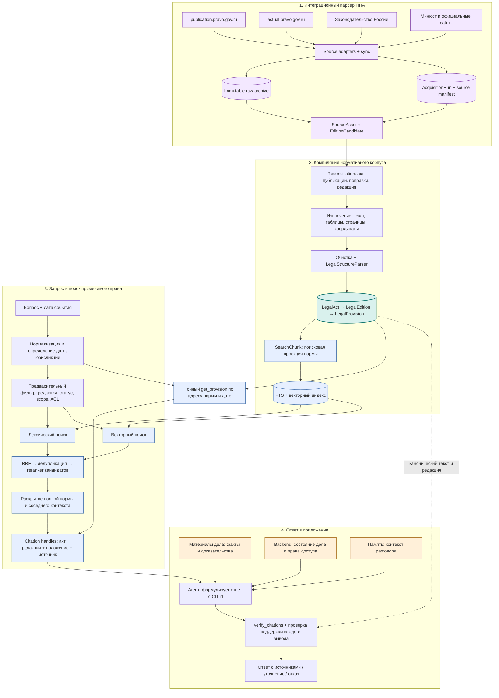

# Целевой пайплайн Legal RAG

**Срез:** 26 сентября 2026 года. Эта схема согласована с [master plan](LEGAL_RAG_MASTER_PLAN_2026.md), [политикой официальных источников](LEGAL_SOURCES_POLICY.md), [архитектурным планом LAW_Data](../../LAW_Data/docs/LEGAL_AGENT_ARCHITECTURE_AND_PLAN.md) и [атласом предыдущих работ](PROJECT_ATLAS.md). Это проектная архитектура; ниже отдельно указано, что реализовано.

Изображение показывает компиляцию и использование уже полученного корпуса. Актуальная схема ниже добавляет перед ними обязательный этап получения НПА из официальных систем.

## Как движутся данные

**Легенда.** Интеграционный парсер получает оригиналы, сводные тексты и метаданные, сохраняет их без изменений и формирует проверяемые кандидаты редакций. `LegalAct`, `LegalEdition` и `LegalProvision` — канонические юридические сущности, возникающие только после reconciliation и review. `SearchChunk` и индексы нужны для поиска; ссылка в ответе ведёт к положению и редакции. Сплошные стрелки обозначают основной путь, пунктир — проверку ответа по каноническому корпусу. Две ветки поиска работают после фильтра; прямой `get_provision` обходит embeddings, RRF и reranker. `verify_citations` детерминированно проверяет идентификатор, редакцию, дату и буквальный текст цитаты; **поддержку смысла вывода** нужно проверять отдельно, в том числе вручную на спорных случаях.

## Границы доверия

| Область | Роль в ответе |
|---|---|
| Нормативный корпус | Правовое основание: только проверенное положение применимой редакции. |
| Материалы дела JKH | Факты дела и происхождение доказательств; не источник права. |
| Backend JKH / будущего продукта | Структурированное состояние проекта, доступ, история, версии документов. |
| Память агента | Удобство диалога; не доказательство факта дела и не правовое основание. |

В продукте правовой ответ и черновик жалобы должны проходить **один и тот же контур поиска и проверки**. При отсутствии применимого положения, неясной существенной дате или сбое retrieval система уточняет вопрос либо отказывается от правового вывода. Судебную практику, если она потребуется, следует вести отдельным типом источников и выдачи.

## Состояние и порядок сборки

| Уже есть | Следует построить |
|---|---|
| Подтверждены документированный API `publication.pravo.gov.ru` и используемый интерфейсом `actual` внутренний JSON backend; это исследовательская проверка, не продуктовый коннектор. | Интеграционный парсер НПА: source adapters, immutable raw archive, `AcquisitionRun`, повторная синхронизация, change report и очередь несопоставленных поправок. |
| LAW_Data: корпус и SQLite FTS5, на срезе 43 файла / 5 220 плоских фрагментов. | Manifest, структурный разбор, канонические редакции и положения, QA сборки. |
| JKH: приложение для дел; собственный нормативный FTS, на срезе 12 файлов / 2 003 фрагмента. | Общий Legal Retrieval API, дата и статус до поиска, точный `get_provision`, проверяемые ссылки. |
| Чат JKH ищет загруженные документы дела. | Подключить к чату нормативный поиск, сохранив отдельный путь для фактов дела. |
| Предыдущие эксперименты Dify/RAGFlow и исследовательский обзор. | Gold set, сравнение FTS → hybrid/RRF → rerank и проверка качества ответа. |

Первый законченный срез: **официальные сервисы → интеграционный парсер → пять неодинаковых НПА с публикациями и кандидатами редакций → Legal AST → канонические положения и редакции → FTS baseline → `get_provision` → проверяемая цитата → один ответ в JKH**. После ручного gold set добавляются векторный поиск, RRF и reranker только там, где они дают измеримый выигрыш. В полном плане PostgreSQL FTS + pgvector — стартовое хранилище, OpenSearch — возможный следующий поисковый слой. Конкретные модели LLM, embeddings и reranker остаются заменяемыми адаптерами.

**Контрольные точки:** идемпотентная повторная синхронизация; обнаружение нового или изменённого исходника; сохранность raw-ответа и SHA-256; сопоставление публикации, поправок и редакции; восстановление нормы и координат из подлинника; правильная редакция на дату; `provision recall@k`; совпадение citation handle с нормой; поддержка каждого юридического вывода; корректный отказ при пустой базе. Контрольный набор должен включать исторические и будущие редакции, исключения, перекрёстные ссылки, ложные предпосылки и вопросы без ответа.
