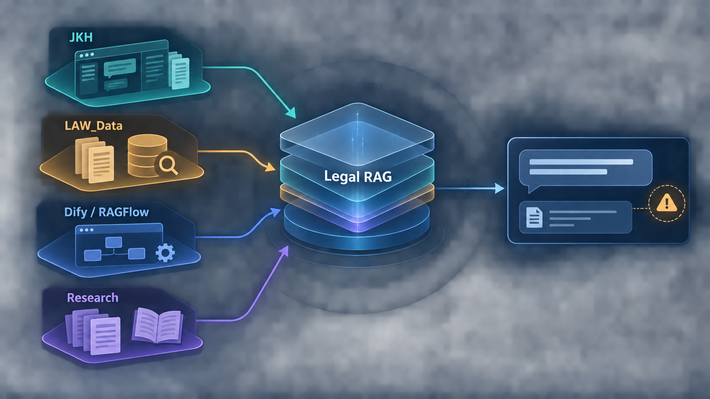
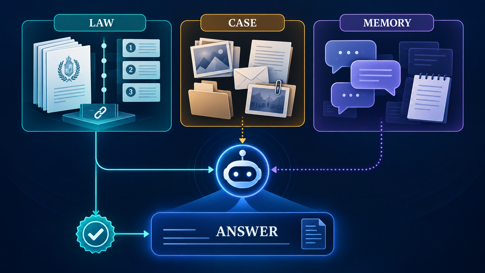
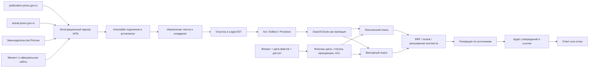

# Атлас Legal RAG

**Срез:** 21 сентября 2026 года. **Назначение:** единая точка входа для разработки правового RAG и приложения на его основе. Это инженерная сводка прежних работ, а не утверждение об актуальности отдельных норм права.

Здесь собраны [реестр чатов и файлов](SOURCES.md), [исследовательская карта](RESEARCH.md) и три иллюстрации imagegen в `assets/`. Исходные проекты и их данные не менялись. Метки ниже означают: **проверено сейчас** — прочитан текущий файл/индекс; **исторически проверено** — результат прежнего чата; **план** — пока не реализовано; **не проверено сейчас** — нужна отдельная проверка перед применением.

Подробная подписанная [схема текущей и целевой архитектуры](assets/legal-rag-architecture.html) и [словарь терминов](GLOSSARY.md) помогают читать этот атлас.

**Легенда:** JKH даёт продукт и дела; LAW_Data — расширенный корпус и поиск; Dify/RAGFlow — испытанные платформы и интеграционные уроки; Research — проверяемые гипотезы и набор метрик. Центральный Legal RAG на рисунке — **целевая система, пока не собранная**.

## 1. Короткое резюме

У нас уже есть два полезных, но раздельных слоя: локальное приложение JKH для дел и жалоб и расширенный юридический корпус LAW_Data. В JKH нормативный поиск работает через отдельный локальный FTS-индекс. Новый чат JKH использует Haystack BM25 **по загруженным материалам дела**, но не подключает этот чат напрямую к нормативному индексу. LAW_Data пока индексирует плоские фрагменты и не реализует описанные в архитектурном плане сущности `LegalEdition` и `LegalProvision`. [Источники J1, J2, L1–L3 в реестре](SOURCES.md).

Главная цель следующего этапа: для каждого юридического утверждения получить цепочку **вопрос → применимая редакция → точное положение → подтверждающий фрагмент → проверяемая ссылка → ответ или отказ**. Сначала нужен работающий небольшой вертикальный прототип и ручной gold set; затем можно решать, нужны ли векторный поиск, RRF, reranker, граф или отдельная платформа. [L1](SOURCES.md), [R1](RESEARCH.md).

Первый продуктовый компонент этого прототипа — **интеграционный парсер НПА**. Это отдельный ingestion-сервис с адаптерами к официальным ресурсам, неизменяемым архивом исходников, журналом синхронизаций и сопоставлением публикаций, поправок и сводных редакций. Он передаёт проверяемые `SourceAsset` в компилятор корпуса; локальный `LAW_Data` остаётся legacy-входом для сравнения и миграции.

## 2. Что существует сейчас

| Направление | Сейчас подтверждено | Ограничение для единого Legal RAG |
|---|---|---|
| **JKH**, `C:\Users\user\Documents\New project` | FastAPI-приложение: дела, чат, документы, маршрутизация ведомств, черновики жалоб, локальный поиск, предупреждения по ссылкам. Встроенный нормативный индекс: **12 файлов / 2 003 фрагмента**. Статус: проверено сейчас по коду, README и SQLite. | Продукт пока локальный и однопользовательский. Чат ищет только по материалам дела. Валидация ссылок сопоставляет названия актов с найденными фрагментами, а не подтверждает каждое утверждение по точной норме и редакции. Есть несохранённые изменения в UI и тестах; их не трогали. |
| **LAW_Data**, `H:\AI_AGENT\LAW_Data` | **42 файла** в `current`, **1** в `historical`, индекс **43 файла / 5 220 фрагментов**; `text_corpus`, SQLite FTS5, сборщик и CLI-поиск. Статус: проверено сейчас по дереву файлов и read-only SQLite. | `chunk_text` использует предел **3 500 символов** и overlap **350**. Legal AST, `LegalEdition`, `LegalProvision`, `SearchChunk`, временная фильтрация, hybrid retrieval и citation handles существуют в плане, но не в коде. |
| **Dify / JKH-Dify** | Локальный checkout, `dify-control.bat`, пилот препроцессора PDF, знание о схеме Knowledge Pipeline. Пилот для одного профиля постановления дал **66 parent / 164 child** чанка и сохранил проверенные номера пунктов. Статус: код и прежняя проверка; текущие контейнеры не запускались. | Пилот не универсален для всех НПА. Короткий системный промт сам по себе не доказывает grounding. Облачный и локальный Dify фигурировали в разных обсуждениях; конкретное развёртывание перед интеграцией нужно определить заново. |
| **RAGFlow** | Был развёрнут локальный эксперимент; изучены датасеты, embedding migration, ограничения GraphRAG, Docker. Статус: исторически проверено, live-состояние сейчас не проверялось. | Предложение делать на RAGFlow публичный многопользовательский MVP было исследовательским вариантом, не утверждённой реализацией. Нужны тест русского правового retrieval, изоляции арендаторов и безопасности. |
| **Научная работа** | Отдельные обзоры 2026 года, разборы MORAG, Index-RAG, semchunk, RAG hallucination repair, дискуссии r/Rag. | Исследования — источник гипотез и тестов, не доказательство, что метод уже улучшит наш российский корпус. Часть материалов — препринты или сообщества. |

**Важный конфликт состояния корпуса.** В LAW_Data каталог и папка `future` по-прежнему содержат две записи с именами `effective_2026-09-01`, хотя дата этого атласа — 21.09.2026. Индекс их не включает. Это сигнал провести юридическую сверку статуса и редакций по авторитетным источникам, затем обновить каталог и только после проверки пересобрать индекс. Никаких файлов корпуса здесь не перемещали. [L2](SOURCES.md).

**Важный продуктовый выбор.** JKH рассчитан на локальную работу одного пользователя, а обсуждавшийся RAGFlow-вариант — на будущую публичную многопользовательскую услугу. Общий слой правовых данных и retrieval можно спроектировать независимо; модель пользователей, доступов, хранилище дел и UI зависят от выбранного сценария. [J1, P2](SOURCES.md).

## 3. Четыре вида информации и границы доверия

| Область | Что хранит | Для чего можно использовать | Чего не позволяет |
|---|---|---|---|
| `legal_corpus` | Подлинник акта, редакции, нормы, реквизиты, интервалы действия, источник публикации | Подтверждать применимое правовое основание | Нельзя считать любой найденный чанк действующей нормой без проверки редакции и статуса |
| `case_documents` | Письма, фото, акты, заявления и прочие файлы конкретного дела | Установить сообщённые факты и происхождение доказательств | Файл пользователя не становится нормативным источником |
| `project_state` | Данные дела, события, действия, статусы, адресаты, черновики | Вести процесс подачи обращения | Не подменяет цитирование закона |
| `agent_memory` | Краткие итоги предыдущих разговоров и предпочтения | Сохранять контекст разговора | Не служит правовым авторитетом |

Эта граница явно описана в [архитектурном плане LAW_Data](../../LAW_Data/docs/LEGAL_AGENT_ARCHITECTURE_AND_PLAN.md) и в прежнем Dify-промте. В JKH её надо отразить технически: у результата поиска по делу нельзя автоматически выставлять юридический статус `VERIFIED` только потому, что файл был загружен пользователем. Сейчас адаптер Haystack именно так маркирует результаты; это конкретная точка интеграционной проверки, а не доказательство некорректного ответа в каждом случае. [J3](SOURCES.md).

## 4. Целевая цепочка данных

**Легенда к рисунку:** 1 — получение из официальных систем и регистрация источника; 2 — извлечение и контроль качества; 3 — нормализация, юридическая структура и редакции; 4 — поиск и ранжирование; 5 — проверка связи «утверждение ↔ источник»; 6 — ответ с подтверждённой ссылкой или корректный отказ.

### Канонический слой

- `LegalAct` — идентичность акта и реквизиты.
- `LegalEdition` — конкретная редакция с датами применения и происхождением.
- `LegalProvision` — адресуемая норма: статья, часть, пункт, подпункт, приложение или таблица.
- `SearchChunk` — фрагмент для поиска, связанный с конкретными нормой и редакцией. Он может быть продублирован в разных поисковых проекциях, но не является самостоятельным источником права.
- `CitationHandle` — стабильная ссылка на норму, редакцию и координаты доказательства. Модель не сочиняет его из текста; сервис выдаёт handle и проверяет его после генерации.

Это **целевая** модель из плана LAW_Data. Её первый прототип лучше сделать на пяти неодинаковых документах: ЖК РФ, ПП РФ № 354, ПП РФ № 491, СанПиН и сложный PDF с приложениями. Пилот должен выдавать JSON Legal AST и отчёт проверки человеком до массовой загрузки корпуса. [L1](SOURCES.md).

### Поиск по вопросу

1. Определить тип вопроса: действующая норма, исторический факт, процедура, судебная практика, вопрос по материалам дела. Выделить дату события; если она неясна и влияет на вывод, запросить её или ограничить ответ.
2. До ранжирования отфильтровать редакции по дате, юрисдикции, статусу проверки и доступу пользователя. Исторические нормы могут быть релевантны только для соответствующего периода.
3. Выполнить лексический поиск по реквизитам/фразам и, после baseline, векторный поиск по перефразировкам. Объединить кандидатов RRF, затем по измеренной необходимости rerank.
4. Развернуть найденный поисковый чанк до полной нормы и нужного соседнего контекста. Перекрёстную ссылку учитывать явно, сохраняя цепочку доказательства.
5. Генерировать короткий ответ из отобранных доказательств. Проверить **каждое** правовое утверждение: та ли норма, та ли редакция, действительно ли текст поддерживает вывод. Неподтверждённый фрагмент убрать, пометить для проверки или перейти к отказу.

Для судебной практики может понадобиться отдельный индекс и нормализация ссылок; практика и нормативные акты не должны смешиваться в одну неразличимую выдачу. [L1](SOURCES.md), [R1](RESEARCH.md).

## 5. Что исследования дают проекту

Полная карта с работами, ссылками, ограничениями и способом применения находится в [RESEARCH.md](RESEARCH.md). Коротко:

| Находка | Для чего | Как проверить у нас |
|---|---|---|
| Качество retrieval часто ограничивает итоговый ответ | Не лечить плохой поиск сменой LLM | Gold set с ожидаемыми `provision_id`, Recall@K и error taxonomy |
| Структурные границы нормы важны | Не разделять заголовок статьи и её текст | Сравнить текущие чанки с Legal AST и замерить точное попадание нормы |
| Редакция и дата — отдельная ось правильности | Не процитировать подлинную, но неприменимую норму | Вопросы на исторические редакции, `edition accuracy` |
| Наличие URL не доказывает поддержку вывода | Проверять утверждения по тексту | Claim-level audit с ручной проверкой спорных случаев |
| Отказ — измеримое поведение | Не отвечать уверенно при пустой базе или ложной предпосылке | No-answer и false-premise тесты, `correct refusal` |
| GraphRAG и многоагентность имеют цену | Вводить только при конкретном измеренном провале | А/Б на вопросах с перекрёстными ссылками после сильного baseline |

`semchunk` подходит как более аккуратный tokenizer-aware способ **разрезать слишком длинную норму внутри её границ**. Прежний тест на 59-ФЗ показал, что обычный режим часто приклеивает заголовок следующей статьи к предыдущему чанку; он не заменяет LegalStructureParser. Index-RAG подсказал хранить координаты и происхождение цитаты, но его заявленный прирост недостоверен из-за 12-вопросной оценки и утечки test labels. [R2–R3](RESEARCH.md).

## 6. План реализации с критериями готовности

**Фаза 0 — интеграционный парсер НПА и реестр источников.** Реализовать минимальное ingestion-приложение с `PublicationPravoConnector`, пилотными `ActualPravoConnector` и `LegislationRussiaConnector`, immutable raw archive и журналом `AcquisitionRun`. На пяти актах получить официальные оригиналы, доступные сводные редакции и связанные поправки; зафиксировать SHA-256, реквизиты, URL, заявленную редакцию, статус сопоставления и проверки. Готово, когда повторный запуск различает unchanged/new/changed/failed, формирует change report, не создаёт дубликаты и ни один принятый исходник не зависит от экспорта коммерческого агрегатора.

**Фаза 1 — вертикальный компилятор.** Пять полученных интеграционным парсером документов → извлечение → очистка → Legal AST → человекочитаемый отчёт → `LegalProvision`/`LegalEdition` → поисковые проекции. Готово, когда тестовые статьи, пункты, приложения и координаты восстанавливаются из официального подлинника; неизвестная структура попадает на ручную проверку.

**Фаза 2 — gold set и baseline.** Набор вопросов по ЖКХ и обращениям: обычные, исключения, отрицания, дата, перепутанная редакция, перекрёстная ссылка, отсутствие ответа и ложная предпосылка. Начать с FTS baseline, сохранив текущий индекс для сравнения. Готово, когда каждый вопрос вручную связан с допустимыми нормами/редакциями или помечен как no-answer, а ошибки разделены по стадиям.

**Фаза 3 — retrieval и citation API.** Добавить лексический + векторный каналы, RRF и, при пользе, reranker. API: `search_legal`, `get_provision`, `verify_citations`; ответы содержат citation handles и статус применимости. Готово, когда provision recall@k, edition accuracy и точность ссылок измерены на отложенном наборе, а старые нормы не попадают в ответы о новых событиях.

**Фаза 4 — ответ и продуктовая интеграция.** Подключить новый правовой сервис к чату JKH, сохранив отдельные каналы для норм, файлов дела и памяти. Добавить claim-level audit и понятный просмотр первоисточника. Готово, когда юридический ответ всегда проходит retrieval и проверку ссылок, а отсутствие достоверного контекста даёт честный отказ. Черновики жалоб требуют той же проверки.

**Фаза 5 — выбор формы приложения.** Для локального однопользовательского пути развивать JKH. Для публичного сервиса сначала отдельно спроектировать пользователей, проекты, ACL, PII, хранение, аудит и эксплуатацию; платформы Dify/RAGFlow сравнить по gold set и эксплуатационным требованиям. Готово, когда решение опирается на измерения и явно выбранную модель развёртывания.

## 7. Метрики и обязательные сценарии

| Слой | Метрика | Пример ошибки, которую она ловит |
|---|---|---|
| Корпус | Доля извлечённого текста, структурная полнота, проверка реквизитов, дубликаты | Пропал пункт приложения или PDF-подвал принят за норму |
| Retrieval | `provision recall@k`, MRR/nDCG, coverage перекрёстных ссылок | Нашли правильный акт, но не нужный подпункт |
| Время | `edition accuracy`, доля недопустимых по дате попаданий | Цитата верна для 2024 года, но вопрос о 2026-м |
| Цитирование | Exact match handle/координат, корректность источника | Реальная ссылка ведёт не к подтверждающему фрагменту |
| Ответ | Claim support, answer correctness, correct refusal | Ответ содержит необоснованное исключение или игнорирует пустую базу |
| Эксплуатация | Latency, стоимость, размер индекса, ручной review rate | Улучшение качества слишком дорого или медленно |

Набор должен содержать и «простые» вопросы, и сложные варианты: устаревшая редакция, будущая норма, льгота с исключением, отрицание, два связанных акта, расхождение документов дела с нормативной базой, ложная предпосылка, неоднозначная дата, несколько допустимых источников. Для каждого случая фиксировать `corpus_version`, `parser_version`, `index_version`, настройки модели и дату оценки.

## 8. Что сейчас остаётся открытым

1. Какая первая версия продукта нужна: локальный JKH для одного пользователя или публичный сервис с проектами и пользователями? Схему права можно начать до ответа, а продуктовые ACL и UI — после выбора.
2. Базовое решение по официальным источникам и замене экспортов агрегаторов записано в [LEGAL_SOURCES_POLICY.md](LEGAL_SOURCES_POLICY.md). Техническое получение, условия использования, устойчивость адаптеров и цепочка редакций теперь входят в обязательный M0 интеграционного парсера до допуска данных в продуктовый корпус.
3. Как задавать применимую дату: дата события, период длящегося нарушения, дата подачи обращения, дата ответа органа? Это доменная спецификация, не один универсальный параметр.
4. Какой уровень ручной проверки необходим для публикации корпуса и для выдачи ответа? Нужны статусы `unreviewed / reviewed / rejected` и правила отказа.
5. Как отображать источники в продукте: акт + редакция + статья/пункт + фрагмент + исходная страница/URL? Прототип UI должен показывать контекст, а не только номер citation.
6. Нужно ли в первом выпуске подключать судебную практику? Это отдельный контур с другим типом авторитетности, цитирования и обновления.

## 9. Как пользоваться атласом

- Чтобы начать кодировать: сначала прочитать разделы 2–4, [политику источников](LEGAL_SOURCES_POLICY.md) и [master plan](LEGAL_RAG_MASTER_PLAN_2026.md), затем выполнить фазу 0 на пяти официально полученных актах и передать сохранённые `SourceAsset` в фазу 1.
- Чтобы выбрать метод: сверить гипотезу с [RESEARCH.md](RESEARCH.md), добавить вопрос в gold set и измерить baseline.
- Чтобы найти исходный чат, код или документ: открыть [SOURCES.md](SOURCES.md). Исторические численные результаты отмечены как таковые; текущие индексы сверены 21.09.2026.

**Imagegen:** все три PNG созданы встроенным `image_gen` для навигации и сохранены в `assets/`. Их финальные промты описаны в [SOURCES.md](SOURCES.md). Для точных требований опираться на текст, таблицы и Mermaid-схему выше: изображения концептуальны и не кодируют фактический статус реализации.
